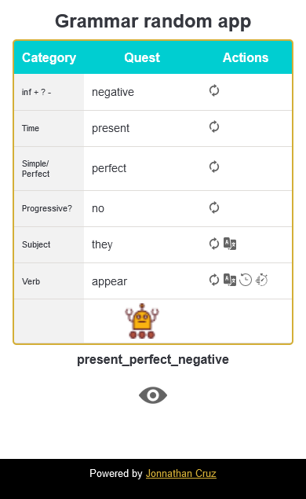
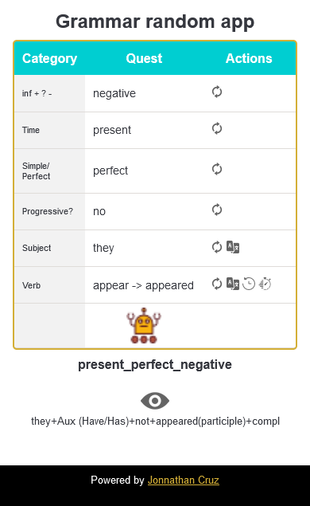

# grammar. Web app English grammar

## Descripción

Una aplicación web para estudiar las estructuras gramaticales en inglés. Al presionar sobre el botón 'robot' de manera aleatoria se genera una estructura gramatical indicando además un sujeto y un verbo para crear una frase. El botón 'eye' muestra la respuesta correcta.

Aquí puedes explorar la [Demo funcional](https://jonnathan-cruz.000webhostapp.com/portfolio/lab/grammar/index.html).

Y aquí puedes ver [todo mi portafolio!!!](https://jonnathan-cruz.000webhostapp.com) -> Ready to Roll Out! 

## Instalación

Descargar y navegar al *index.html* de la raíz usando un apache para ello. Ejemplo de URL típica usando *XAMPP* y colocando el proyecto en la carpeta *hdocs*:
http://localhost/grammar/index.html.

## Screenshots

## Pruebas

Presionar botón 'robot'  para iniciar, cada categoría en la estructura de la frase puede ser generada de nuevo aleatoriamente con el botón que aparece en frente . El botón 'eye'  debe ocultar o mostrar la respuesta de cada estructura generada. Existen otros botones especiales en las categorías siguientes:
- Subject:
    -  Traducir al español
- Verb:
    -  Traducir al español
    -  Forma en pasado del verbo
    -  Forma en participio del verbo

## Licencia

Este código se distribuye bajo licencia GPLv3.

